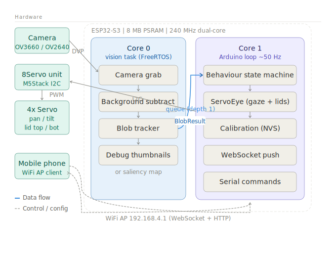
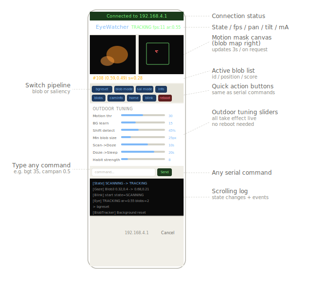
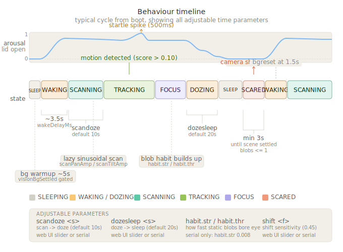

# Eye in the Sky

Animatronic security camera eye art installation. A wide-angle camera hidden below a security camera housing drives a servo-controlled human eyeball with eyelids, tracking motion in the scene and sleeping when nothing moves.

Three units are deployed outdoors on poles. Each runs independently with its own WiFi access point for remote configuration from a mobile phone, requiring no cable connection after deployment.


## Figures

### Figure 1 — System architecture



**Data flow:** Camera -> Core 0 grabs frames, runs blob tracker, posts `BlobResult` to a single-slot queue. Core 1 reads the queue every loop tick, runs the state machine, drives servos via I2C. The WebSocket server on Core 1 pushes status and canvas data to any connected phone.

**Key constraint:** Camera init must happen before `Wire.begin()` because both use internal I2C peripherals. Core 0 handles only the vision task -- no blocking calls.

---

### Figure 2 — Web UI



Connect: join WiFi `EyeWatcher-{UNIT_ID}` (password: `eyewatch`), open `http://192.168.4.1`. iOS/Android open the browser automatically via captive portal. If not, navigate manually -- always use `http://`, not `https://`.

---

### Figure 3 — Behaviour timeline



**Transitions:**

| From | To | Trigger | Adjustable |
|------|-----|---------|-----------|
| SLEEPING | WAKING | `blob.score > 0.15` | -- |
| WAKING | SCANNING | `visionBgSettled` + 3.5s | `wakeDelayMs` |
| SCANNING | TRACKING | `blob.score > 0.10` | `bgt` threshold |
| TRACKING | FOCUS | sustained 8s, 1 blob | -- |
| SCANNING | DOZING | no blobs for N seconds | `scandoze <s>` |
| DOZING | SLEEPING | dozing for N seconds | `dozesleep <s>` |
| Any | SCARED | camera shift detected | `shift <f>` |
| SCARED | WAKING | elapsed > 3s + scene calm | -- |

**Note:** Blob habituation (`habit.str`, `habit.thr`) controls how quickly a stationary person loses the eye's interest while in TRACKING state -- not a state transition but a score suppression that eventually causes TRACKING -> SCANNING when all blobs habituate below threshold.

---

## Hardware (per unit)

| Component | Details |
|-----------|---------|
| MCU | Seeed XIAO ESP32-S3 Sense |
| Camera | OV3660 (on Sense board) or OV2640 (external long cable) |
| Servo driver | M5Stack 8Servo Unit (I2C 0x25) |
| Servos | 4x SG90 -- pan, tilt, upper lid, lower lid |
| Grove Shield | Seeed Grove Shield for XIAO (I2C on GPIO5/6) |

### Servo wiring (M5Stack 8Servo channels)

| Channel | Function |
|---------|----------|
| ch0 | Pan (eyeball left/right) |
| ch1 | Tilt (eyeball up/down) |
| ch2 | Lower eyelid |
| ch3 | Upper eyelid |

### Camera mounting

Camera is fixed, pointing the same direction as the eye, mounted below-center in the same security camera housing. The camera sees a wide-angle view of the space; the eye moves to point at detected motion.

---

## Software

Built with PlatformIO / Arduino framework for ESP32-S3 (Earle Philhower core).

### Dependencies (platformio.ini)

```ini
lib_deps =
    bblanchon/ArduinoJson @ ^7.1.0
    https://github.com/ESP32Async/AsyncTCP.git
    https://github.com/ESP32Async/ESPAsyncWebServer.git
```

### File structure

```
include/
  config.h          Central config: WiFi, servo channels, camera pins, behaviour params
  states.h          EyeState enum + stateName()
  blob_tracker.h    Motion blob detection, tracking, habituation
  behaviour.h       State machine (SLEEPING/WAKING/SCANNING/TRACKING/SCARED/DOZING)
  servo_eye.h       Servo animation: gaze EMA, arousal model, 3-position lid, blink
  calibration.h     NVS-backed per-unit servo calibration (working copy / commit)
  vision.h          Camera init + Core 0 FreeRTOS task + pipeline switch API
  saliency.h        Saliency map pipeline (alternative to blob tracker)
  web_ui.h          WiFi AP + WebSocket + embedded HTML configuration UI
  m5servo8.h        M5Stack 8Servo I2C driver

src/
  main.cpp          Setup, loop, serial commands, processCommand()
  blob_tracker.cpp  Background subtraction, flood fill, blob tracking + habituation
  behaviour.cpp     Eye state machine
  servo_eye.cpp     EMA gaze, arousal, 3-position lid animation, blink
  calibration.cpp   Interactive calibration + NVS load/save (work/data model)
  vision.cpp        Camera init (OV3660/OV2640/OV5640 auto-detect), Core 0 task
  saliency.cpp      Saliency pipeline (motion + colour + brightness + habituation)
  web_ui.cpp        AsyncWebServer, WebSocket status/canvas frames, embedded HTML
  m5servo8.cpp      M5Stack 8Servo driver
```

---

## Architecture

### Dual-core split

```
Core 0 (FreeRTOS task)               Core 1 (Arduino loop ~50Hz)
-------------------------------       -------------------------------
visionTask                            behaviour_sm.update()
  camera grab (PSRAM)                   read blobQueue (non-blocking)
  blob tracker or saliency              state machine transitions
  post BlobResult ─────────────────►   eye.update() -> I2C servos
  update debug thumbnails               webUiLoop() -> WebSocket push
                                        handleSerial()
```

### Vision pipeline

Two pipelines selectable at runtime (`blob` / `sal` commands):

**BLOB (default, outdoor recommended):**
Background subtraction (motion-gated EMA) -> motion mask -> morphological open -> flood fill connected components -> nearest-neighbour track matching across frames -> blob habituation -> BlobResult

**SALIENCY (indoor, artistic):**
Weighted channels (motion 90%, colour 6%, brightness 4%) -> habituation map suppression -> NMS peak finding -> adapted to BlobResult via single-blob adapter

### State machine

```
BOOT -> SLEEPING (lids closed, bg model building, visionBgSettled=false)
     -> (visionBgSettled + isFirstBoot) WAKING
     -> scheduleBackgroundReset(1500ms) at 1.5s into waking
     -> (bg settled) SCANNING (lazy sinusoidal scan)
     -> (blob.score > 0.10 + bgSettled) TRACKING
     -> (sustained) FOCUS
     -> (no blobs 10s) DOZING -> (20s) SLEEPING

Any state -> SCARED (shift detected: blobTrackerShiftDetected)
          -> lids snap shut, cancelBlink(), scheduleBackgroundReset(500ms)
          -> wait: elapsed > 3s AND visionBgSettled AND blobs <= 1
          -> WAKING (cautious, no startle)
```

### Arousal model (lid animation)

Arousal (0.0-1.0) interpolates across three calibrated lid positions:

| Arousal | Lid position | State |
|---------|-------------|-------|
| 0.0 | Fully CLOSED | SLEEPING / SCARED |
| 0.5 | REST -- iris framed | SCANNING / default awake |
| 0.55 | Slightly above REST | TRACKING |
| 1.0 | MAX OPEN | Startle only (decays 500ms) |

Blink interval and duration scale inversely with arousal -- drowsy blinks are slow and rare.

### Background model

Exponential moving average, updated only at pixels not currently moving (motion-gated). Key timings at default bgr=15 (0.015/frame) at ~11fps:
- 63% convergence: ~65 frames (~6s)
- 95% convergence: ~200 frames (~18s)

Auto-resets: startup warmup, on wake from sleep (at 1.5s into WAKING), on camera shift detected, periodic every 5 minutes.

---

## Per-device configuration

Set in `platformio.ini` build flags:

```ini
build_flags =
    -DUNIT_ID=1        ; SSID becomes EyeWatcher-1
    -DWIFI_CHANNEL=11  ; pick least-congested channel (1, 6, 11 most common)
```

`WIFI_CHANNEL` can also be set in `config.h` as fallback. Scan your deployment location and choose an empty channel. For three units, they can all share one channel or use different ones -- there is no cross-unit coordination.

---

## Serial interface

Connect at 115200 baud. For ANSI live display use:
```
pio device monitor --filter=direct
```
Then type `ansi` to toggle the live motion mask + blob map display.

### Key commands

| Command | Effect |
|---------|--------|
| `status` | Full status: state, WiFi AP, bg settled, uptime, heap |
| `ansi` | Toggle live ANSI display |
| `bgreset` | Force background model reset |
| `blob` / `sal` | Switch vision pipeline |
| `bgt <n>` | Motion threshold (default 30; raise to 35-45 outdoors) |
| `bgr <n>` | BG learning rate x1000 (default 15; lower for moving trees) |
| `minblob <n>` | Min blob pixels (default 25; lower for distant people) |
| `minage <n>` | Min blob age in frames (default 12) |
| `shift <f>` | Camera-shift threshold 0-1 (default 0.45) |
| `blobtimeout <n>` | Track timeout ms (default 800) |
| `habit.str <f>` | Blob habituation rate (default 0.008) |
| `scandoze <n>` | Seconds scan before doze (default 10) |
| `dozesleep <n>` | Seconds doze before sleep (default 20) |
| `campan <f>` | Camera pan scale (0.5 for wide-angle) |
| `camtilt <f>` | Camera tilt scale |
| `camoffx <f>` | Pan offset (-0.5 to +0.5) |
| `camoffy <f>` | Tilt offset |
| `camflipx` | Toggle horizontal mirror |
| `cal` | Enter calibration mode |
| `home` | Eye to calibrated center |
| `blink` | Trigger one blink |
| `reboot` | Restart |

---

## Calibration

Type `cal` in serial monitor. Normal operation pauses while calibration runs.

### Workflow

Calibration uses a **working copy** (`work`) separate from the committed values (`data`). All nudges edit `work` only. Nothing is written to NVS until you type `save`. The status line shows `* UNSAVED *` when work differs from data. Typing `exit` without saving discards all changes.

```
cal
tilt           -- select tilt axis (starts editing CENTER)
+ + +          -- nudge; status shows "tilt center = 92 deg"
min            -- switch to editing MIN, servo jumps to stored min
- - -          -- nudge to mechanical minimum
max            -- switch to editing MAX
+ + +          -- nudge to mechanical maximum
save           -- validate + commit to NVS
exit
```

### Axes

| Axis | Sub-positions |
|------|--------------|
| `pan` | `center` `min` `max` |
| `tilt` | `center` `min` `max` |
| `top` | `rest` `closed` `maxopen` |
| `bot` | `rest` `closed` `maxopen` |

### Lid positions

| Position | Meaning |
|----------|---------|
| `closed` | Blink / sleep -- lids fully shut |
| `rest` | Normal awake -- iris just framed |
| `maxopen` | Maximum opening -- surprise/startle |

### Preview and test commands (inside cal)

`show rest` / `show closed` / `show maxopen` -- preview both lids together
`test` -- full servo sweep through all calibrated ranges
`blink` -- test blink animation
`arouse` -- sweep arousal closed->rest->maxopen->rest->closed

Calibration stored in NVS namespace `eyecal`. Reset with `reset` command inside cal.

---

## Web UI

Each unit broadcasts:
- **SSID:** `EyeWatcher-{UNIT_ID}`
- **Password:** `eyewatch`
- **URL:** `http://192.168.4.1`

iOS/Android show a captive portal notification on joining -- tap to open. If not, navigate to `http://192.168.4.1` manually (use http, not https).

### Features

- Live motion mask + blob map (canvas, updates every 3s)
- State, fps, pan, tilt, arousal, mA in header (updates every 1s)
- Blob list with positions and scores
- Quick action buttons
- **Outdoor tuning sliders** -- all key parameters adjustable without serial cable
- Command input for any serial command
- Scrolling log panel

### Outdoor tuning slider guide

| Slider | Typical outdoor value |
|--------|-----------------------|
| Motion threshold | 35-45 (wind, shadows, leaves) |
| BG learn rate | 8-12 (slow-moving background) |
| Shift detect | 50-55% (vibration from wind/pole) |
| Min blob size | 12-15 (distant people) |
| Min blob age | 15-20 (glints, reflections) |
| Blob timeout | 1200-1500ms (slow walkers) |
| Habit strength | 15-25 (suppress static lights) |

---

## Camera support

Auto-detected on boot. No configuration change needed when swapping cameras.

| Sensor | PID | Clock | Grab mode |
|--------|-----|-------|-----------|
| OV3660 | 0x3660 | 20MHz | GRAB_LATEST |
| OV2640 | 0x26 | 10MHz | GRAB_WHEN_EMPTY |
| OV5640 | 0x5640 | 20MHz | GRAB_LATEST |

Two-phase init: JPEG UXGA first (required to correctly size DMA buffers), then reinit as GRAYSCALE QVGA for processing. This is mandatory for OV3660/OV5640 -- starting directly at QVGA causes silent grab failures on these sensors.

The OV2640 requires 10MHz XCLK and GRAB_WHEN_EMPTY. Using 20MHz or GRAB_LATEST causes `esp_camera_fb_get()` to return null silently with no error code.

A diagnostic sketch (`cam_test/`) tries all combinations systematically and reports which config works -- useful for diagnosing suspected hardware faults.